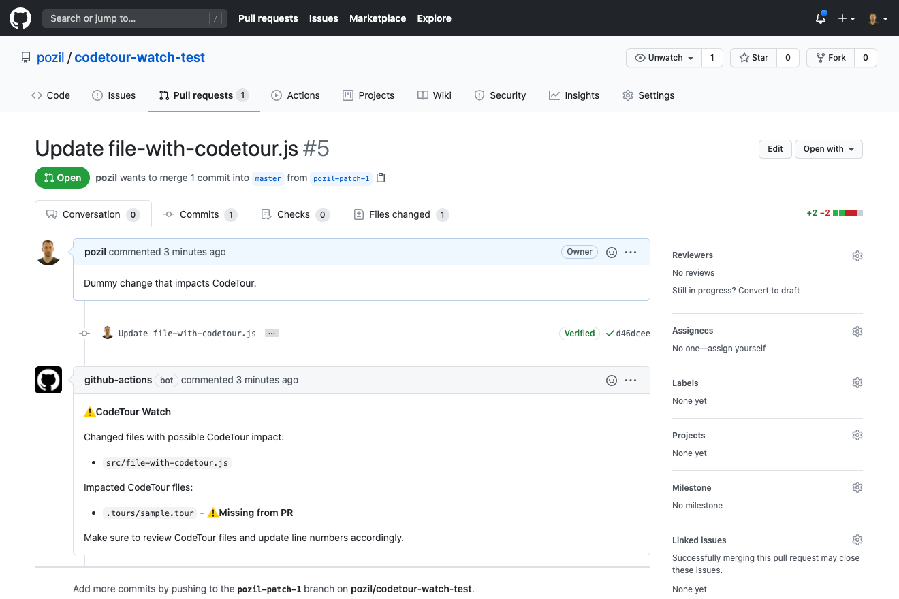

[](https://github.com/marketplace/actions/codetour-watch)

# CodeTour Watch

A GitHub action that flags file changes in a PR that may affect [CodeTour content](https://marketplace.visualstudio.com/items?itemName=vsls-contrib.codetour).

The action comments on the PR to report changes that may impact CodeTour:



The action will not comment the PR if changes do not impact CodeTour.

## Usage

```yml
name: CodeTour watch

on:
    pull_request:
        types: [opened, edited, synchronize, reopened]

jobs:
    codetour-watch:
        runs-on: ubuntu-latest
        steps:
            - name: 'Checkout source code'
              uses: actions/checkout@v2
        
            - name: 'Watch CodeTour changes'
              uses: pozil/codetour-watch@v1.2.0
              with:
                  repo-token: ${{ secrets.GITHUB_TOKEN }}
```

## Inputs

| Name         | Required | Description                                                     | Default  |
| ------------ | -------- | --------------------------------------------------------------- | -------- |
| `repo-token` | true     | The GITHUB_TOKEN, required to comment.                          |          |
| `silent`     | false    | Optional flag that turns off the comment on the PR.             | `false`  |
| `tour-path`  | false    | Optional flag that specifies a custom `.tours` folder location. | `.tours` |

## Outputs

| Name                 | Description                                                                          |
| -------------------- | ------------------------------------------------------------------------------------ |
| `impactedFiles`      | The list of files covered by tours that were changed.                                |
| `impactedTours`      | The list of tours that were impacted by the PR.                                      |
| `missingTourUpdates` | The list of tours that were impacted by the changes but that are not part of the PR. |
